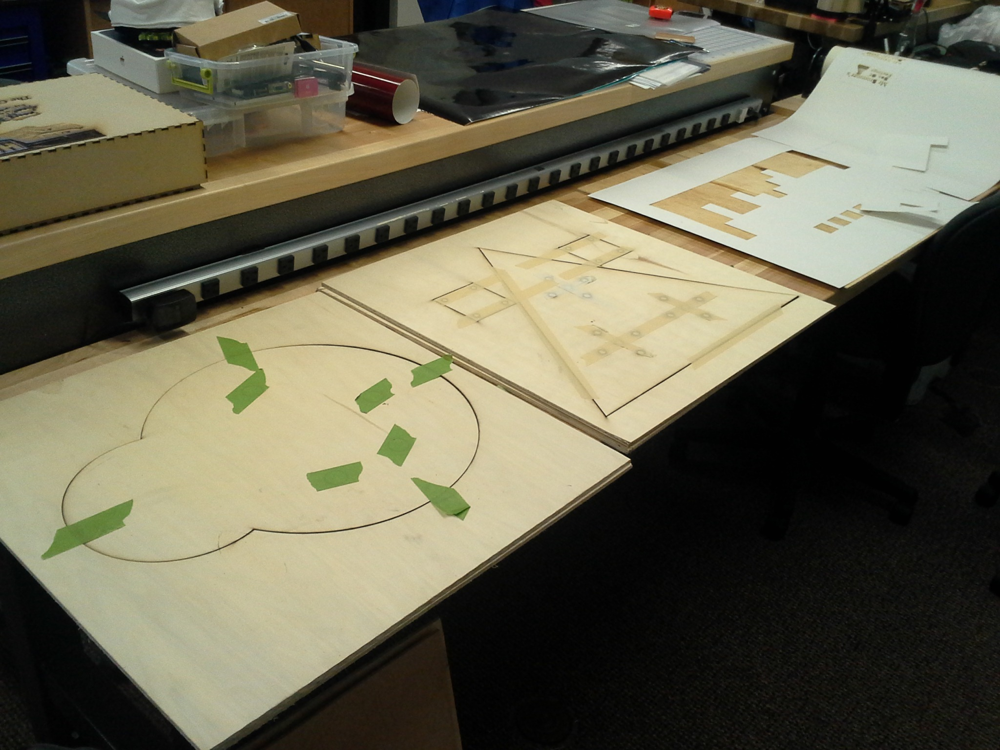
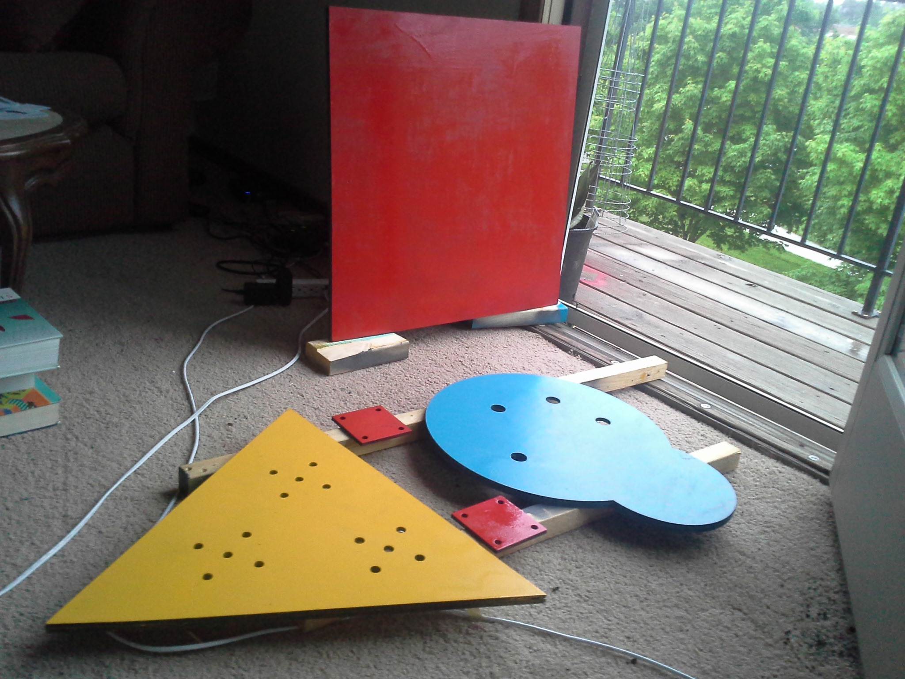
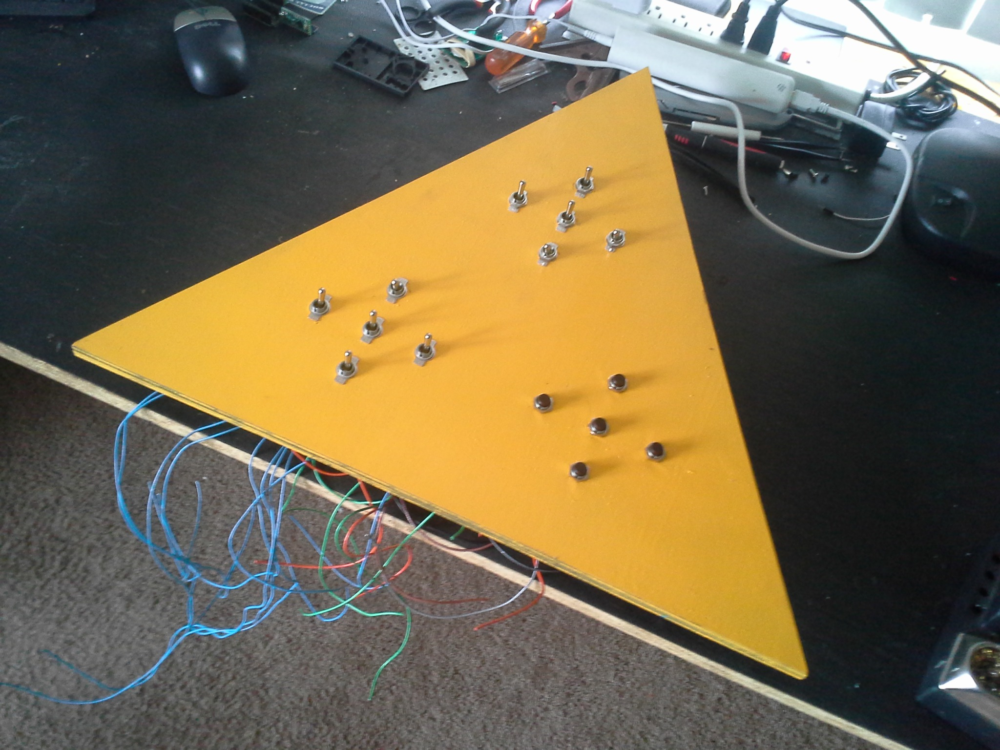
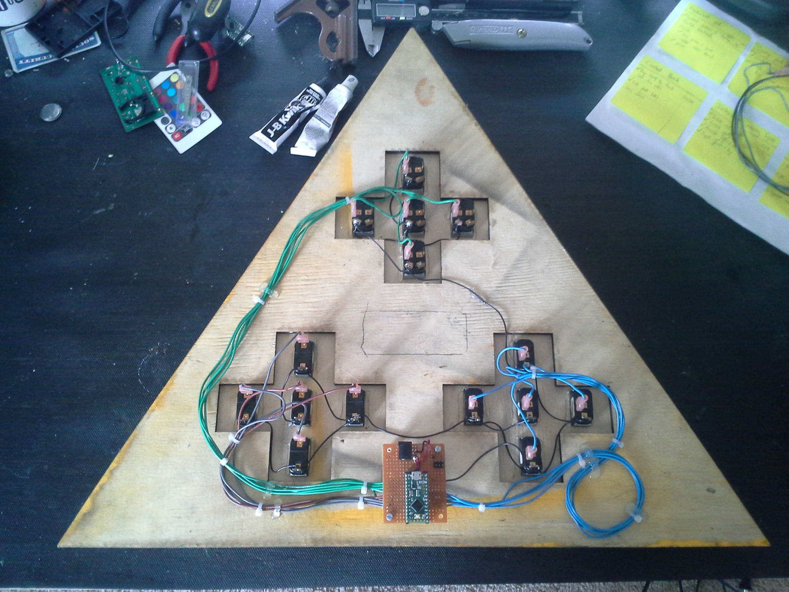
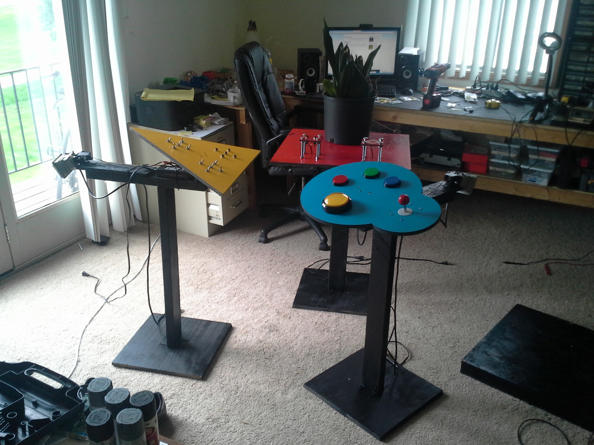
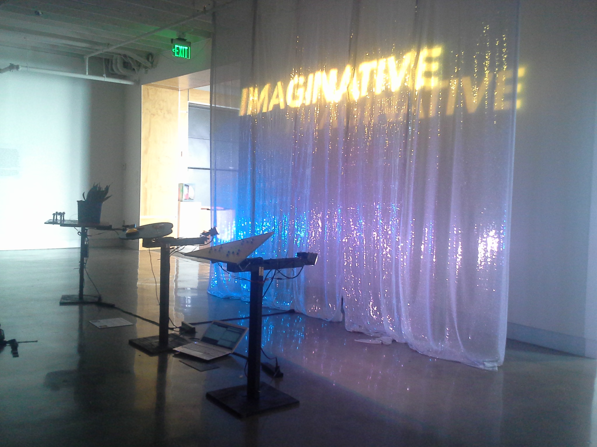

## Interactive moving lights
A series of three interactive RGB LEDs attached to pan/tilt mechanisms and paired with colorful control panels. As the control panels are manipulated, the LEDs move and change colors in strange ways.

* Blue panel - circular laser-cut panel with four large dome buttons and a classic arcade joystick
* Yellow panel - triangular laser-cut panel with three banks of buttons and toggle switches.
* Red panel - square panel with a circular softpot, two pushbuttons and a plant outfitted with piezo transducers to detect hits.

## Images

### Fabrication

**Laser cutting panels**

**Spray painting panels**

### Wiring

### Assembly

### Installation

